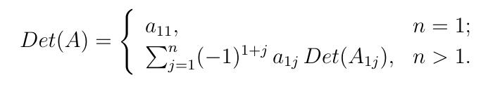
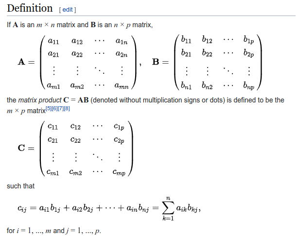
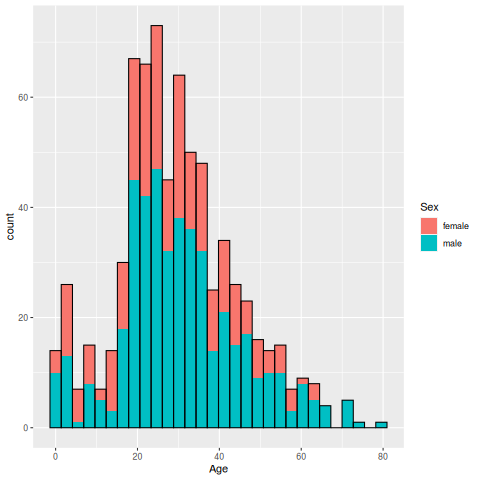

# Scripts

Aqui podran encontrar los distintos scripts desarrollados en las clases que tengamos.

## Table of contents
1. [Ayudantia 1](#introduction)
2. [Ayudantia 2](#paragraph1)
3. [Ayudantia 3](#paragraph2)
4. [Ayudantia 4](#paragraph3)

## Ayudantia 1 <a name="introduction"></a>
1. Sol_list1.R

Solucion listado 1.

2.sort.c

Como se menciona en la solucion ultimo ejercicio del primer listado. La solucion al algoritmo para ordenar numeros se trata solo de una traduccion de este mismo pero en lenguaje C.

## Ayudantia 2 <a name="paragraph1"></a>
3. Sol_list2.R

Solucion listado 2.

4. primes.c

La funcion del **ejercicio 9** la traduje de lenguaje C nuevamente. La saque de la pagina [studytonight](https://www.studytonight.com/c/programs/numbers/first-n-prime-numbers) por si les interesa ver su explicacion.

## Ayudantia 3 <a name="paragraph2"></a>
El tema principal de esta ayudantia son **funciones** (recursivas principalmente). Veremos la funcion para encontrar en n-simo primo, multiplicar dos matrices y calculo de determinante.

La del calculo de determinante la pueden encontrar en el script **Ayudantia3part2.R** y corresponde a la implementacion de la definicion que conocemos de algebra.



Lo mismo ocurres con la multiplicacion de dos matrices, correspondiente al archivo **Producto2matrix.R**.



## Ayudantia 4 <a name="paragraph3"></a>
En este listado se ocupa en varias ocasiones **ggplot** para realizar los distintos graficos pedidos.

Esto ya que como pueden ver en [stackoverflow](https://stackoverflow.com/questions/63867741/creating-stratified-histogram-using-an-r-function), cuando el grafico se complica en ocasiones es mas sencillo usar *ggplot*, que las funciones base del lenguaje.

```R
ggplot(datos, aes(x = Age)) +
    geom_histogram(aes(fill = Sex)) +
    geom_histogram(fill = NA, color = "black")
```



para mas informacion sobre **ggplot**, visitar la pagina [R CHARTS](https://r-charts.com/ggplot2/).
